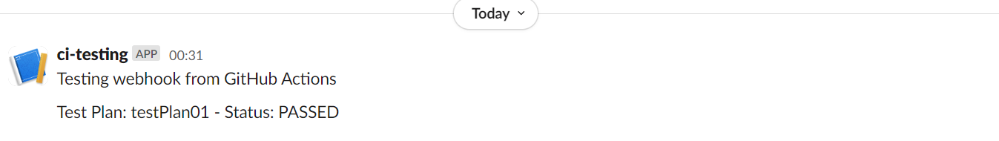

# JMeter Load Tests

This project is designed to perform load testing using Apache JMeter for both UI and API endpoints. It is set up to run tests automatically using GitHub Actions and report results to a Slack channel.

## Project Structure

- **.github/workflows/load-test.yml**: GitHub Actions workflow configuration for running load tests.
- **jmeter/tests/testPlan01.jmx**: JMeter test plan for UI load testing.
- **jmeter/results/.gitkeep**: Keeps the results directory tracked by Git.
- **scripts/run-tests.sh**: Shell script to execute JMeter tests.
- **.gitignore**: Specifies files and directories to be ignored by Git.

## Setup Instructions

1. **Clone the Repository**: 
   ```sh
   git clone <repository-url>
   cd jmeter-load-tests
   ```

2. **Configure JMeter**: 
   Update the `config/jmeter.properties` file with your desired settings (if needed).

3. **Set Up Slack Webhook**: 
   Create a webhook in your Slack channel and store the webhook URL in your GitHub repository secrets as `SLACK_WEBHOOK_URL`.

4. **Automated Testing**: 
   The tests will automatically run on every push to the repository, as defined in the GitHub Actions workflow.

## Reporting

Test results will be sent to the specified Slack channel after each test run. Ensure that the webhook is correctly configured to receive messages.




## Usage Guidelines

- Modify the JMeter test plans in the `jmeter/tests` directory to suit your testing needs.
- Review the results in the `jmeter/results` directory after each test run.

## Setting up to run test locally:

1. **Download Java**: Ensure you have Java installed on your machine. You can download it from [Oracle's website](https://www.oracle.com/java/technologies/javase-downloads.html).

2. **Download Apache JMeter**: Download the latest version of Apache JMeter from the [official website](https://jmeter.apache.org/download_jmeter.cgi).

3. **Install JMeter Plugins**: 
   Visit [JMeter Plugins](https://jmeter-plugins.org/), search for 'Graphs', and download '3 Basic Graphs' and '5 Additional Graphs'.

4. **Extract Plugins**: 
   After downloading, the plugins need to be extracted and placed into the appropriate `ext` and `lib` folders within the JMeter installation directory.

5. **Run Tests Locally**: 
   To run tests locally without using the UI, use the following CLI command:
   ```sh
   jmeter.bat -n -t Test_Plan_01.jmx -l Test_Plan_01_A.jtl -e -o Test_Plan_01_A
   ```

   


6. **View Reports**: 
   The reports can be viewed in the `bin` folder, for example:
   ```sh
   C:\apache-jmeter-5.6.3\bin\Test_Plan_01_A\index.html
   ```


